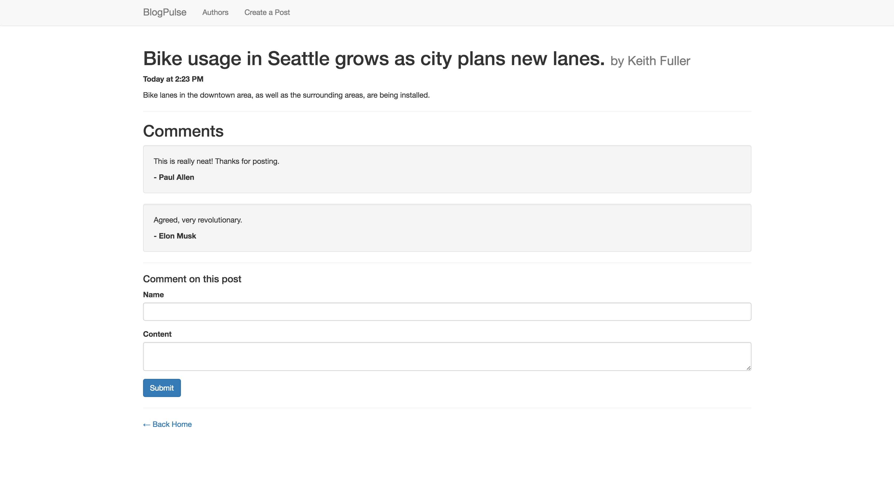

# Express BlogPulse

To practice 1:M associations, we'll be adding comment functionality to an existing blog application.

#### Backstory: BlogPulse

Congrats! You have been hired by BlogPulse, an up-and-coming blog marketed as a local version of [Buzzfeed](https://www.buzzfeed.com/). Through BlogPulse, anyone can sign up to become a contributor, and contributors can create posts relating to issues and events in the Puget Sound area. However, we need you to add comment functionality to this site.

## Getting Started

We'll be using an existing application that includes two models, several routes, and several views.

* Fork and clone this repository
* Run `npm install` to install dependencies
  * Use `nodemon` to start your application
  * Use `npm run lint:js` to lint your JS
  * Use `npm run lint:css` to lint your CSS
* Setup your database (this app already has two existing models)
  * Run `createdb blogpulse_development` to create the database
  * Run `sequelize db:migrate` to run migrations
  * Run `sequelize db:seed:all` to populate the database with 2 authors and 2 posts

#### Read the Code

After setup, **STOP**. You're using an existing application, so make sure to read the code and ensure what the application does. Here is some information about the current setup.

* Routes
  * `GET /` - home page that lists all posts
  * `GET /authors` - authors page that lists all authors
  * `POST /authors` - creates a new author, then redirects back to `GET /authors`
  * `GET /authors/new` - page that has a form for creating a new author
  * `GET /authors/:id` - page that shows a specific author and their posts
  * `POST /posts` - creates a new post, then redirects back to `GET /`
  * `GET /posts/new` - page that has a form for creating a new post
  * `GET /posts/:id` - page that shows a specific post and the author
* Models
  * `author`
    * Attributes: `firstName`, `lastName`, `bio`
    * Associations: Has many posts
  * `post`
    * Attributes: `title`, `content`, `authorId`
    * Associations: Belongs to one author

## User Stories

* As a user, I want to comment on a post in order to express my opinions.
* As a user, I want to view comments on a post in order to see my community's opinions about a post.

## Requirements

#### Part 1: Create a Comment model

In order to add comments, create a Sequelize model to store comments. It's recommended that you name this model `comment`. It will store three attributes: the name of the person creating the comment (as a string), the content of the comment (as text), and the post that the comment belongs to (as an integer)

Once this model has been created, **add the associations between comments the posts**. Then, run the migration for the model and test the model's functionality. This can be done in a separate file. An example:

**dbTest.js**

```js
var db = require('./models');

db.comment.create({
  name: 'Paul Allen',
  content: 'This is really neat! Thanks for posting.',
  postId: 1
}).then(function(comment) {
  console.log(comment.get());
});
```

Be sure to also test querying comments off of posts, which should verify that the association exists. Here's an example, once you've created a comment:

```js
var db = require('./models');

db.post.find({
  where: { id: 1 },
  include: [db.comment]
}).then(function(post) {
  // by using eager loading, the post model should have a comments key
  console.log(post.comments);
});
```

#### Part 2: Integrate the model with the app

Now that the model has been created, you'll want to add the ability to create and view comments to the rest of the application. Here is an approach that can be taken:

* Add the ability to view comments on `GET /posts/:id`.
  * See the example above on how to include the comments, then use EJS to render each comment's information on the page. Make sure you have a comment in the database you can use to verify this functionality.
* On the same page (`GET /posts/:id`), create a form to submit a new comment. Note that we don't *necessarily* need to render a form on a separate page.
  * Include the necessary attributes, `name` and `content`. Feel free to look at the forms for authors and posts as examples.
  * Create a new route to receive this form data. This will be the action for your form. A good route to define could be `POST /posts/:id/comments`. Note how we're passing the post id.
    * Test the route by sending the form body
    * Once you've verified the route is working, save the form body using Sequelize. Redirect back to the post that was commented on.
* Verify functionality by creating more authors, posts, and comments. Pay attention to the user experience, and make sure the user can navigate between posts, authors, and comments.

#### Part 3: Styling

When finished with the above, style the application appropriately with CSS. Use other media and blog sites as examples.

## Bonuses

* Add the ability to edit posts
* Instead of redirecting to `/authors/new` to create a new author, have the form appear using a Bootstrap modal.
* Add the ability to create rich text posts and comments using Markdown.
  * Front-end Bootstrap Markdown editor: http://www.codingdrama.com/bootstrap-markdown/
  * A markdown parser for your EJS templates: https://www.npmjs.com/package/marked#usage

## Deliverables

Here's an example screenshot of the post page, complete with comments. Your finished deliverable will differ and include the desired functionality.



---

## Licensing
1. All content is licensed under a CC-BY-NC-SA 4.0 license.
2. All software code is licensed under GNU GPLv3. For commercial use or alternative licensing, please contact legal@ga.co.
